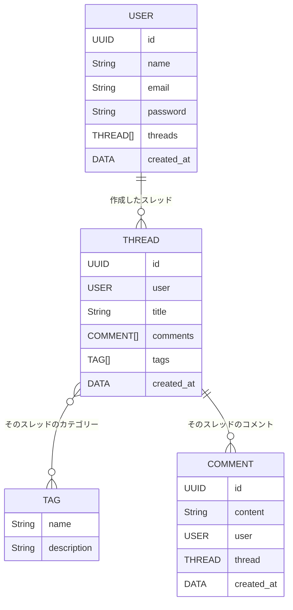

```mermaid
erDiagram
  USER ||--o{ THREAD: "作成したスレッド"
  THREAD }o--o{ TAG: "そのスレッドのカテゴリー"
  THREAD ||--o{ COMMENT: "そのスレッドのコメント"
  USER {
    UUID id
    String name
    String email
    String password
    THREAD[] threads

    DATA created_at
  }
  THREAD {
    UUID id
    USER user
    String title

    COMMENT[] comments
    TAG[] tags

    DATA created_at
  }
  COMMENT {
    UUID id
    String content
    USER user
    THREAD thread

    DATA created_at
  }
  TAG {
    String name
    String description
  }
```
